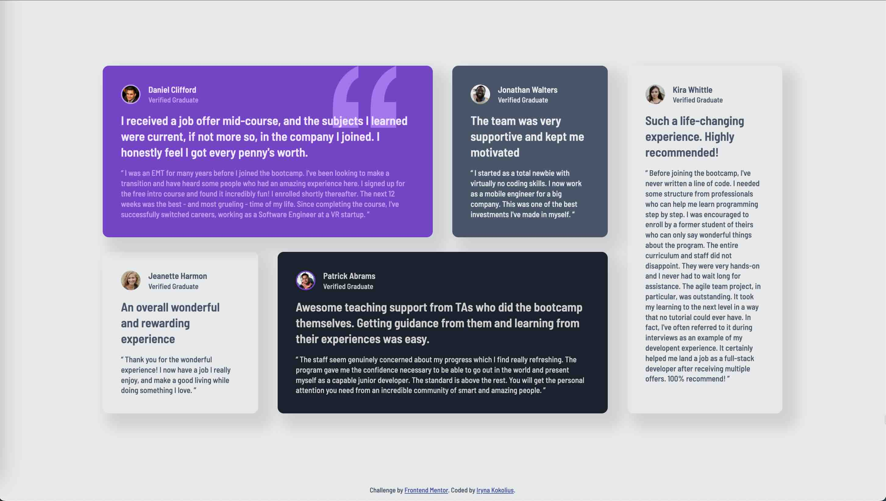

# Frontend Mentor - Testimonials grid section solution

This is a solution to the [Testimonials grid section challenge on Frontend Mentor](https://www.frontendmentor.io/challenges/testimonials-grid-section-Nnw6J7Un7). Frontend Mentor challenges help you improve your coding skills by building realistic projects.

## Table of contents

- [Overview](#overview)
  - [The challenge](#the-challenge)
  - [Screenshot](#screenshot)
  - [Links](#links)
- [My process](#my-process)
  - [Built with](#built-with)
  - [Useful resources](#useful-resources)
- [Author](#author)

## Overview

### The challenge

Users should be able to:

- View the optimal layout for the site depending on their device's screen size

### Screenshot

### Links

- Solution URL: [Github](https://github.com/ikokolius/testimonials-grid-section)
- Live Site URL: [Live](https://ikokolius.github.io/testimonials-grid-section/)

## My process

### Built with

- Semantic HTML5 markup
- CSS custom properties
- Flexbox
- CSS Grid
- Mobile-first workflow

### Useful resources

- [Conquering Responsive Layouts course by Kevin Powell](https://courses.kevinpowell.co/conquering-responsive-layouts) - I have started this awesome 21-day course, and although I am just starting week 2, I have found it really helpful in understanding responsive layouts.

## Author

- LinkedIn - [Iryna Kokolius](www.linkedin.com/in/iryna-kokolius)
- Frontend Mentor - [Iryna Kokolius](https://www.frontendmentor.io/profile/ikokolius)
- CodePen - [Iryna Kokolius](https://codepen.io/irynakokolius)
